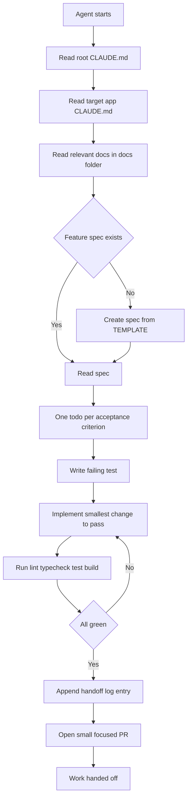

# Agent Framework

How AI coding agents are governed on this repo: how they pick up work, what context they are
given, what they are allowed and forbidden to do, how "done" is checked mechanically, and how a
human verifies an agent followed the rules.

**Read this first if you are reading only one document.** It is the governance layer that sits on
top of the reference documents other agents are producing in parallel: `docs/ARCHITECTURE.md`,
`docs/DATA-FLOW.md`, `docs/STATE-INVENTORY.md`, `docs/DATA-INVENTORY.md`, `docs/MODULE-MAP.md`,
`docs/TESTING.md`, `docs/ENDPOINT-INVENTORY.md`, `docs/KNOWN-GAPS.md`. This file does not repeat
their content — it references them.

## The governing principle

**A rule that is not mechanically enforced is not a rule, it is a wish.**

This repo already had a written agent process before this document existed — a spec-per-feature
template, a TDD requirement, a handoff-log format, a set of invariants — documented in
`docs/AGENT-HANDOFF.md` and `docs/ENGINEERING-GUIDE.md` §5 and §11. It was followed **zero times**
across the five feature PRs merged to date: 45,000+ LOC shipped, 5 test files total, the one
feature spec that exists (`docs/features/0001-identity-dual-accept-auth.md`) is still marked "NOT
STARTED", and no handoff entry has ever been written. The reason is simple: there was no CI, so
nothing checked whether the process had been followed, and goodwill alone did not produce it.

Every restriction in the guardrail table below (§3) is labeled **ENFORCED** or **ADVISORY**.
ENFORCED means a specific command fails — CI, a type error, a lint rule, a test. ADVISORY means it
depends on human review or agent goodwill, exactly like the rules that were skipped last time.
Where something is ADVISORY today, that is stated plainly, not smoothed over — see §7.

---

## 1. How an agent picks up work

Read order, top to bottom, before writing any code:

1. Root `CLAUDE.md` — invariants that apply everywhere.
2. The target app's `CLAUDE.md` (`apps/api`, `apps/storefront`, `apps/worker`, `apps/cms` — see
   the gap noted in §2 for `apps/cms`).
3. The generated reference docs in `docs/` (`ARCHITECTURE.md`, `MODULE-MAP.md`,
   `ENDPOINT-INVENTORY.md`, `STATE-INVENTORY.md`, `DATA-INVENTORY.md`, `DATA-FLOW.md`,
   `TESTING.md`, `KNOWN-GAPS.md`) — read these **instead of** grepping the codebase cold. They
   exist so an agent does not have to re-derive architecture from scratch every session.
4. The feature spec in `docs/features/<name>.md`, created from `docs/features/_TEMPLATE.md` if it
   does not exist yet. No spec, no code.

Then: one todo per acceptance criterion in the spec → TDD (co-located test first) → implement →
run the Definition of Done commands (§4) → hand off (§5).



---

## 2. The context an agent is given

The brief hierarchy is `CLAUDE.md` (or `AGENTS.md`) files at increasing specificity, plus the
generated reference docs as a substitute for re-exploring the codebase:

| Level | File | What belongs there |
|---|---|---|
| Root | `CLAUDE.md` | Cross-cutting invariants that apply to every app: proxy shrinks, dual-accept auth, no plaintext email, no real outbound creds. Points into `docs/`. |
| App | `apps/api/CLAUDE.md`, `apps/storefront/CLAUDE.md`, `apps/worker/CLAUDE.md` | Module map or folder layout, app-specific rules, the one line telling the agent where to find its feature spec. |
| Cross-app | `tests/CLAUDE.md` | Why unit tests are co-located and this folder is contract/e2e only. |
| Feature | `docs/features/<name>.md` | The actual unit of work: acceptance criteria, data contracts, files to touch, test plan, done checklist, handoff log. |

**Reference docs, not re-exploration.** `docs/ARCHITECTURE.md`, `docs/MODULE-MAP.md`,
`docs/ENDPOINT-INVENTORY.md`, `docs/STATE-INVENTORY.md`, `docs/DATA-INVENTORY.md`,
`docs/DATA-FLOW.md`, and `docs/TESTING.md` are what an agent reads to answer "where does X live"
or "what does Y call" instead of grepping the whole tree cold each session. `docs/KNOWN-GAPS.md`
is what an agent reads before assuming something is unimplemented, or before assuming something
that looks unfinished actually is (see the `proxy/` origin-spoofing example in §3 — the single
best case of code that looks removable and is not).

**The gap, stated plainly:** `apps/cms/CLAUDE.md` currently contains a single line, `@AGENTS.md`,
which points at `apps/cms/AGENTS.md`. That file is not a project brief — it is auto-generated by
`next dev` on every dev-server start (confirmed at
`node_modules/next/dist/server/lib/generate-agent-files.js`) and contains generic Next.js
version-migration boilerplate, not one word about this codebase. `apps/cms` is the largest
application in the repo — 145 files, ~29,000 LOC, 96 routes — and it is the one app with no real
agent brief. Until this is fixed, an agent working in `apps/cms` has only the root `CLAUDE.md` and
whatever it can find in `docs/`. This is a documentation gap to close, not a currently-working
system to describe as working.

---

## 3. Restrictions — the guardrail table

| Rule | Why | Status | What fails if broken |
|---|---|---|---|
| Never commit secrets or live tokens | A live 128-char production token (`LOOM_TABLE_EXPLORER_TOKEN`) was hardcoded in `apps/storefront/src/app/api/backend/[...path]/route.ts` and pushed to `main` in a merged PR. It has been in git history since that merge. Rotation on the Loom side, not just removal, is required. | ADVISORY | Nothing today. No secret scanner runs in CI (there is no CI — see §7). Caught only by a human reviewer reading the diff, which did not happen the first time. |
| Never point outbound email/SMS/WhatsApp/payments at real credentials outside a sandbox | Real customer contact data lives in the production database (see `apps/worker/CLAUDE.md`). An agent testing a notification feature against real creds sends real messages to real customers. | ADVISORY | Nothing automated. Root `CLAUDE.md` and `apps/worker/CLAUDE.md` state it; enforcement is review-only. |
| Never remove the `Origin`/`Referer` spoofing in the `/api/backend` proxy routes | This is the sharpest "looks like dead code, is not" trap in the repo. Both proxy routes (`apps/storefront/src/app/api/backend/[...path]/route.ts`, `apps/cms/src/app/api/backend/[...path]/route.ts`) rewrite the outgoing `origin`/`referer` header before forwarding to the legacy Loom backend. `@NVerseDomainValidated`, a Spring annotation on 114 of 249 legacy Java controllers, rejects any request whose `Origin` is missing or not on an allowlist. An agent that "cleans up" this header rewrite because it looks like a spoofing hack (which it is) will silently break every one of those 114 endpoints in production, because the header being sent is not the header the browser actually sent. | ADVISORY | No test currently exercises this. Nothing fails locally or in CI if it is removed; the break only surfaces against the live legacy backend. This is the single highest-value thing for a human reviewer to check on any diff that touches either `route.ts`. |
| Never persist decrypted email | Legacy stores email encrypted at rest; decrypting server-side and writing it back in plaintext creates a new leak surface. Decrypt only at the API boundary, per `apps/api/CLAUDE.md` and `docs/adr/0003-managed-postgres-and-email-crypto.md`. | ADVISORY | No lint rule or test currently checks this. Review-only. |
| Do not break legacy Loom token acceptance before cutover | Auth is dual-accept during migration (`docs/features/0001-identity-dual-accept-auth.md`, `docs/runbooks/cutover.md`): both legacy and native tokens must resolve until the cutover runbook says otherwise. Breaking legacy acceptance early locks out every user who has not re-authenticated. | ADVISORY | The dual-accept feature spec exists but is unbuilt (status "NOT STARTED"). There is no guard test yet because the guard itself does not exist yet. Once built, this becomes testable and should move to ENFORCED. |
| No feature merges without tests | Stated in root `CLAUDE.md`, every app `CLAUDE.md`, and `docs/ENGINEERING-GUIDE.md` §4. This is the rule that was violated most completely: 5 merged feature PRs, 5 test files total across the whole repo. | PARTIALLY ENFORCED | `pnpm test` runs in `package.json` and is green today (5/5, see §4), so a broken test fails the command — but nothing currently runs that command as a merge gate, because there is no CI (§7). An agent or reviewer must run it manually. |
| Types at the boundary — no raw `fetch().json()`, Zod schema from `@anuprerna/types` | Stated in `apps/storefront/CLAUDE.md` and `docs/ENGINEERING-GUIDE.md` §4. | ADVISORY, and currently **not followed** | `pnpm typecheck` does not catch this — `response.json() as Promise<T>` type-checks fine, it is just wrong at runtime. `packages/types` has one example schema and the intended path, `src/lib/api.ts`, has zero importers; the real fetch path is undocumented and unvalidated. Stated here as an aspiration with an honest baseline, not a working control. |
| Never widen `proxy/` | `apps/api/src/proxy/` is the strangler catch-all; it must only shrink as routes migrate to real modules (`apps/api/CLAUDE.md`, `docs/adr/0002-strangler-proxy-migration.md`). | ADVISORY | No test asserts route count in `proxy/` decreases or stays bounded. Review-only today; a route-count check is a cheap CI addition (see §7). |
| Do not fabricate data to fill a UI | Real incident: roughly 15 CMS routes ship hardcoded values presented as live data — a diagnostics page reading `"Uptime: 14 days, 6 hours"`, a fabricated Java stack trace on a thread-dump screen, an invented `"Total bandwidth saved: 4.8 GB"` figure. None of these call a real endpoint; several sit next to a service method that already exists and is simply never called (e.g. `workflow-service.ts` has `getWorkflows()` but `/manage-workflow/process` hardcodes an array instead of calling it). This is a trust issue, not a cosmetic one: a client or user cannot tell invented numbers from real ones. The rule is absolute — an honest empty state or a real endpoint call, never invented data. | ADVISORY | No automated check distinguishes a real fetch from a hardcoded literal. This is caught only by a human reading the diff and, ideally, by the fix already tracked in `docs/KNOWN-GAPS.md`. |
| Do not add `@ts-nocheck` to new files | Suppressing the type checker on a new file defeats the one mechanical guarantee TypeScript gives (`docs/ENGINEERING-GUIDE.md` §6, "no `any` at boundaries"). | PARTIALLY ENFORCED | `pnpm typecheck` would still pass with a `@ts-nocheck`'d file present — the directive suppresses checking inside that file, not the overall task exit code — so this is not caught by the command alone. A `grep -r "@ts-nocheck" apps/ packages/` check is the cheap way to make this ENFORCED; not wired into CI yet (§7). |

---

## 4. Definition of done

Mechanically checkable. An agent must run these and see them green before opening a PR; a human
reviewer re-runs them before merging.

```bash
pnpm lint
pnpm typecheck
pnpm test
pnpm build
```

Current real baseline on this branch (`chore/agent-substrate`), verified today:

| Check | Result |
|---|---|
| `pnpm typecheck` | **6/6 packages pass** (`@anuprerna/types`, `api`, `storefront`, `cms`, `worker`, plus the workspace root) |
| `pnpm test` | **5/5 test suites pass** — 5 tests total, all in `apps/storefront` (`cart.store.test.ts`, `auth.store.test.ts`) |
| `pnpm build` | **5/5 apps/packages build** |

This is a real, verified baseline, not an aspiration — it was confirmed by running the three
commands against this branch before writing this document. It is also a narrow baseline: 5 tests
covering two Zustand stores in one app is not meaningful coverage of 45,000+ LOC. Green here means
"nothing currently detectably broken," not "well tested." See `docs/TESTING.md` for the honest
coverage picture and `docs/KNOWN-GAPS.md` for what is untested.

Checklist an agent completes before declaring work done, from `docs/AGENT-HANDOFF.md`:

- [ ] Co-located `*.spec.ts` / `*.test.tsx` written first (TDD) and passing.
- [ ] `@anuprerna/types` updated for any new or changed data contract.
- [ ] `pnpm lint`, `pnpm typecheck`, `pnpm test` green for every touched package.
- [ ] A route removed from `apps/api/src/proxy/` if this converted a legacy read.
- [ ] The feature spec's own "Done when" checklist fully checked.
- [ ] Handoff log entry appended (§5).

---

## 5. How work is handed off

Every feature spec (`docs/features/<name>.md`) ends in a `## Handoff log` section. On completing
any unit of work — even a partial one — the agent appends a dated entry. The next agent (or human)
reads it and trusts it without re-deriving the state of the work from the diff.

Format: `<date> — <agent/dev> — <what changed, what's verified, what's deliberately deferred, and
the exact next step>`.

No entry has ever been written in this repo — `docs/features/0001-identity-dual-accept-auth.md`
still reads `(none yet)`. The worked example below is provided precisely because an agent given a
format with zero real examples tends to produce a useless one (a restatement of the diff, or a
generic "implemented the feature" line with no next step).

**Worked example** (illustrative — the dual-accept auth feature has not actually been built; this
shows the shape a real entry should take):

```
2026-08-12 — agent (session b2a549d0) — Implemented DualAcceptGuard in
apps/api/src/identity/guards/dual-accept.guard.ts. Verified: legacy Loom token and native token
both resolve to the correct user (2 new tests in dual-accept.guard.spec.ts, both green); invalid
token returns 401 with request-id logged. Deferred: acceptance criterion 4 ("new login issues a
native token; legacy tokens are never minted") is NOT done — IdentityService.login() still mints
a legacy-format token, tracked as a TODO in identity.service.ts:41. Did not remove any proxy/
route yet because /authenticate is still served by proxy/ pending criterion 4. Next step: fix
IdentityService.login() to mint native tokens, then remove apps/api/src/proxy/auth.proxy.ts's
/authenticate route and update this checklist.
```

Note what makes this useful: it names exact files and line numbers, states which acceptance
criteria are and are not met (not just "done"), and gives the next agent a single concrete next
action instead of "continue the work."

---

## 6. Multi-agent working rules

When more than one agent works on this repo concurrently (as is happening right now — this
document and eight others are being written in parallel):

- **File-level ownership, stated up front.** Each agent is told exactly which file(s) it owns for
  the session and instructed to create or edit nothing else. This document's own brief is an
  example: it owns `docs/AGENT-FRAMEWORK.md` only.
- **Small, focused PRs.** One feature or one fix per PR, linked to its spec, per
  `docs/ENGINEERING-GUIDE.md` §6. Large multi-concern PRs are what make review (the main current
  enforcement mechanism, per §7) unreliable.
- **Shared/root config files** (`package.json`, `turbo.json`, `pnpm-workspace.yaml`,
  `tsconfig.base.json`, `packages/config/*`, every `CLAUDE.md`) are not touched by a feature agent
  incidentally. A change to one of these is its own small PR with its own review, because it
  affects every other app and every other agent's in-flight work.
- **Requesting a change to a file you do not own:** do not edit it directly. Note the needed change
  in your own handoff log entry (§5) as a named next step, or open a narrowly-scoped PR against
  only that file with the reason stated in the PR description. This keeps concurrent agents from
  silently overwriting each other's work on shared files — the same class of collision that
  produced, for example, two independently-written and inconsistent `/api/backend` proxy routes
  (storefront's and cms's) with different hardcoded origins and no shared implementation.

---

## 7. How we verify an agent complied

Honestly, in three tiers:

**Currently enforced by a command (run manually, not gated):**
- `pnpm typecheck` — real type errors fail this. Verified green (6/6) on this branch today.
- `pnpm test` — a failing or deleted test fails this. Verified green (5/5) today, but only 5 tests
  exist; a broken feature with zero test coverage produces no failure here.
- `pnpm build` — a build-breaking change fails this. Verified green (5/5) today.
- `pnpm lint` — configured per app (ESLint 9 flat config for `api`/`cms`, legacy `.eslintrc.json`
  for `storefront`; `packages/types` and `packages/ui` have no lint config at all, per
  `docs/KNOWN-GAPS.md`).

**Currently reviewed by a human, not automated:**
- Every rule in the §3 guardrail table marked ADVISORY.
- Whether a feature spec exists and is accurate before code is written.
- Whether the handoff log entry is honest and specific enough to be useful (§5).
- Whether a diff touching either `/api/backend/route.ts` preserves the `Origin`/`Referer` rewrite.
- Whether new UI code calls a real endpoint or fabricates data.

**Currently unverifiable — the honest gap:**
- **There is no CI on this branch.** No `.github/workflows` directory exists anywhere in the repo.
  Every command in §4 is something an agent or reviewer must remember to run by hand — exactly the
  condition that let five feature PRs merge with 45,000+ LOC and 5 test files. Nothing in this
  document changes that fact by itself; writing down the rule is not the fix, wiring CI is.
- No secret scanner runs anywhere, which is how the live token in §3 reached `main`.
- No check asserts the `proxy/` route count only decreases.
- No check greps for `@ts-nocheck` in new files.
- No check enforces "types at the boundary" — a `.json() as Promise<T>` cast type-checks cleanly.

**The immediate next step**, stated plainly rather than implied: stand up CI (a single GitHub
Actions workflow running `pnpm lint typecheck test build` on every PR) is the highest-leverage
single change available, because it converts every command in §4 from something an agent might
forget to run into something that blocks a merge automatically. Until that exists, everything in
the ADVISORY column of §3 remains, by this document's own definition, a wish rather than a rule.
