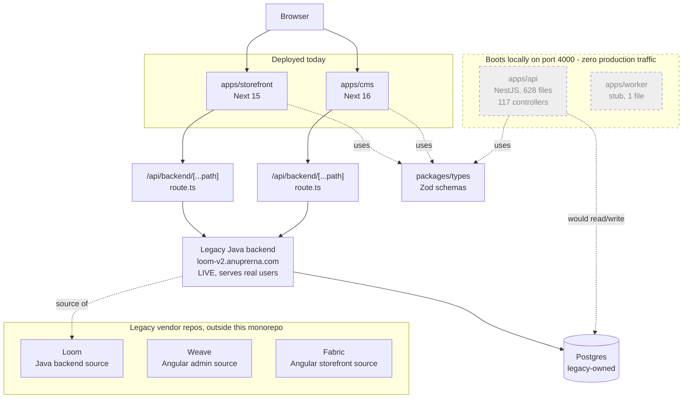
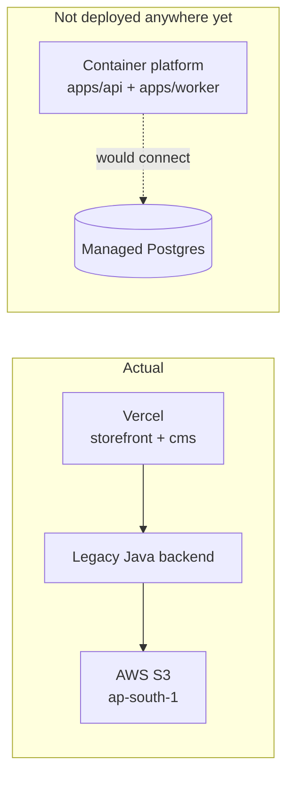
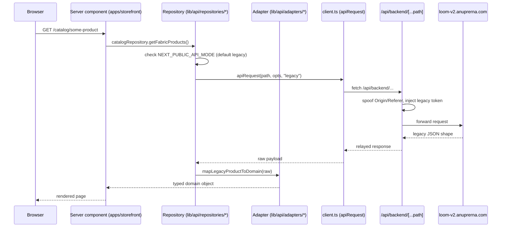

# Architecture

Status: current as of `main`, 2026-08-12. This is the orientation document for
humans and AI agents. If something here disagrees with the code, the code wins — file an issue
against this doc.

## 1. What this system is

Anuprerna is a handloom / artisan-textile commerce platform: a storefront where customers browse
and buy handwoven fabric and made-to-order garments, and an admin console ("CMS") where staff
manage catalog, orders, artisans, and content. The platform previously ran entirely on a
vendor-built, vendor-locked stack — a Java "Loom" backend, an Angular "Weave" admin, an Angular
"Fabric" storefront — that Anuprerna does not own the source of outright. This monorepo is a
self-owned rebuild of that stack (Next.js frontends, a NestJS backend), being cut over
incrementally via the **strangler-fig pattern**: new code is built alongside the legacy system and
traffic is migrated route by route, not in one cutover.

## 2. Component landscape

The single most important fact about this system: **the new backend now boots, but still carries
zero production traffic.** It runs on `:4000` and serves Swagger at `/docs` — four broken imports
that `@ts-nocheck` had been concealing (lint/typecheck/build all passed while `node dist/main.js`
died at `MODULE_NOT_FOUND`) are fixed. But it is still not deployed anywhere, and both live
frontends still call the legacy Java backend directly through a proxy route. Do not read "the API
boots now" as "the migration has progressed" — nothing points production traffic at it yet.



Verified counts (re-run `find`/`grep` yourself before trusting these on a later pass):

- `apps/api/src`: 628 `.ts` files, 117 `*.controller.ts`, 348 files still carrying `@ts-nocheck`,
  spanning `commerce/` (55 subdomains), `identity/`, `auth/`, `workflow/`, `migration/`, `proxy/`,
  `database/`. Swagger UI wired at `/docs` (`apps/api/src/main.ts:77`), app listens on
  `PORT` env var (`apps/api/src/main.ts:80`, defaults to 3000; local `.env` sets `PORT=4000`).
- `apps/storefront/src`: tests only verified in this pass — 163 storefront tests across 14 files.
  `apps/cms/src`: 93 tests across 15 files. `apps/worker/src`: 1 file (`index.ts`, a placeholder —
  no queue, no jobs registered).
- `packages/types/src`: 2 tests (1 Zod schema, `customer.schema.ts`, plus its test).
  `packages/ui/src`: 1 file, `export {}` — no components yet. `packages/config`: shared
  `eslint.base.mjs` / `tsconfig.base.json`, no runtime code.
- Test totals (`vitest run` per workspace, 2026-08-12): api 330, storefront 163, cms 93, types 2 —
  **588 total.** Gates on `main`: lint 3/3, typecheck 6/6, test 6/6, build 5/5, all green in CI.

## 3. Strangler-fig migration state

| Domain | Legacy (live) | Rebuilt in `apps/api` | Cut over? |
|---|---|---|---|
| Product catalog, cart, checkout, orders, payments | Yes — serves all real traffic | Yes — `commerce/` subdomains implemented | **No** |
| Identity / auth | Yes — legacy JWT, dual-accept planned | Yes — `identity/` (empty shell), `auth/` (`GatekeeperService`: `bcrypt(pepper + password)` at cost 11 via `bcryptjs`, tokens signed with `jose`) | **No** |
| Workflow / artisan management | Yes | Yes — `workflow/` module | **No** |
| Storefront UI | Fabric (Angular) retired; `apps/storefront` (Next 15) is live and serves users | N/A (frontend) | Frontend: done. Backend calls: still 100% legacy. |
| Admin UI | Weave (Angular) retired; `apps/cms` (Next 16) is live and serves users | N/A (frontend) | Frontend: done. Backend calls: still 100% legacy. |
| Background jobs (email, Zoho sync, payment webhooks) | Handled inline by legacy backend | Not started — `apps/worker` is a 3-line stub | **No** |
| `proxy/` module (intended landing zone for cut-over routes) | — | `apps/api/src/proxy` exists as an empty `@Module({})` | Not yet used |

**Bottom line: 0% of production request volume transits `apps/api` today.** Both frontends were
already rebuilt on Next.js and serve real users, but every data read/write from those frontends
still goes to the legacy Java backend at `loom-v2.anuprerna.com`. `apps/api` is a completed
backend rebuild waiting for a cutover plan, not yet a deployed service.

## 4. Deployment topology

| Component | Target | Status |
|---|---|---|
| `apps/storefront` | Vercel | **Actual.** Live, serving real customer traffic. |
| `apps/cms` | Vercel | **Actual.** Live, serving real staff traffic. |
| Legacy Java backend | `loom-v2.anuprerna.com` | **Actual.** Live, both frontends depend on it via proxy. |
| `apps/api` | Container (target platform unspecified) | **Aspirational.** No deployment exists. No Dockerfile / IaC verified in this pass. |
| `apps/worker` | Container | **Aspirational.** Code is a stub; nothing to deploy yet. |
| Managed Postgres for `apps/api` | Unspecified managed provider | **Aspirational.** `apps/api`'s Drizzle schema currently targets a local dev Postgres (see §7); no managed instance is wired. |
| S3 / R2 for assets | `NEXT_PUBLIC_S3_BASE_URL` → AWS S3 (`anuprerna-bloomscorp` bucket, `ap-south-1`) | **Actual**, but owned by the legacy stack, not this repo. |



## 5. Monorepo layout

| Path | Owns | Size (verified) |
|---|---|---|
| `apps/storefront` | Customer-facing site, Next 15, App Router | 128 files |
| `apps/cms` | Staff admin console, Next 16, App Router | 143 files |
| `apps/api` | Rebuilt NestJS backend — 55 commerce subdomains, auth, workflow. Boots on `:4000`; not deployed. | 628 files / 117 controllers |
| `apps/worker` | Background job runner (email, Zoho sync, webhooks). Not started. | 1 file, stub |
| `packages/types` | Cross-app Zod schemas — the intended single source of truth for API contracts | 2 files, 1 schema |
| `packages/ui` | Shared UI primitives | empty (`export {}`) |
| `packages/config` | Shared ESLint / TS base configs | config files only, no runtime code |
| `docs/` | ADRs, feature specs, runbooks, engineering guide, handoff log | see `docs/README.md` |
| `tests/` | Intended home for e2e/Playwright suite | not yet populated |

Root `pnpm typecheck` / `pnpm build` / `pnpm test` run via Turborepo (`turbo.json`) across all
five workspaces.

## 6. Request path walkthrough (high level)

This is how a storefront page resolves **today** — everything still ends at the legacy backend,
regardless of the `apps/api` code sitting unused alongside it:



Each repository (e.g. `apps/storefront/src/lib/api/repositories/catalog.repository.ts`) branches
on `NEXT_PUBLIC_API_MODE` and has a legacy code path (used today) and a `nest` code path (written,
never selected — the env var defaults to `"legacy"` and nothing in the deployed environment sets
it to `"nest"`). `apps/cms` has its own proxy (`apps/cms/src/app/api/backend/[...path]/route.ts`)
with the same shape but a hardcoded target host and no env override.

For the line-by-line trace — every fetch site, every adapter, response shapes — see
`docs/DATA-FLOW.md`.

## 7. Key architectural decisions and consequences

**Dual legacy/nest adapter pattern.** Storefront repositories (`lib/api/repositories/*.ts`) each
implement two paths: a `legacy` path that maps the Java backend's response shape to a domain type
via `adapters/legacy-*.adapter.ts`, and a `nest` path that does the same for the future
`apps/api` shape via `adapters/nest-*.adapter.ts`. The switch is `NEXT_PUBLIC_API_MODE`
(`apps/storefront/src/env.ts:5`), an enum of `"legacy" | "nest"` defaulting to `"legacy"`. This is
the intended cutover mechanism: flipping the env var per-route (once `apps/api` is deployed and
route-parity is verified) is meant to be the migration, not a rewrite. As of this pass, the `nest`
path is unexercised in production — it exists in code but is never selected.

**Why the proxies spoof the `Origin`/`Referer` header — load-bearing, do not remove.** Both
`/api/backend/[...path]` routes (`apps/storefront/src/app/api/backend/[...path]/route.ts:19-20`,
`apps/cms/src/app/api/backend/[...path]/route.ts:14-16`) overwrite the outbound `Origin` and
`Referer` headers before forwarding to the legacy backend, rather than passing the browser's real
origin through. The legacy Java backend's CORS/security layer requires a present and
allowlisted `Origin`; requests without one, or with an origin outside its allowlist, are rejected.
Removing this spoofing breaks every proxied call in production. Treat this as a hard constraint on
both proxy routes until the legacy backend's CORS policy changes or the routes stop targeting it.

**The Drizzle schema is introspected, not hand-authored — and it had drifted badly.** The schema
was regenerated from the live production database on 2026-08-12: production has **117 tables**
(the previous schema said 116 — `custom_impact_factor` was missing entirely) and **45 enums** (the
previous schema said 68; the 23 extras were phantom non-`_enum` twins like `order_status` beside
`order_status_enum`, left over from a database that had carried two naming generations). Three
enums were also missing values production actually uses: `order_status_enum` was missing
`PARTIALLY_DISPATCHED`, `settings_attribute_enum` was missing `IMPACT_ASSUMPTIONS`, and
`user_role_enum` was missing `ROLE_ARTISAN` — meaning the backend previously had no concept of an
artisan role at all, on a platform built around artisans. All three are now present. See
`docs/DATA-INVENTORY.md` for the full table/enum accounting.

`drizzle-kit introspect` output does not compile or apply as generated — it has three standing
defects (206 unterminated `.default(')` empty-string literals, unbalanced parentheses in
`sub_category_audit.changed_at`, `enum_ops` applied to a `bigint` index column) that were hand-
repaired in `schema.ts` with comments, and regenerate on every re-run of introspect. There is a
single snapshot migration, no incremental migration chain, and no CI check that the schema still
matches the live database. Treat the schema as a point-in-time mirror, not a maintained source of
truth — re-introspect (and re-repair) before trusting it for anything that matters.

**A local production dataset now exists for development against this schema:** database
`loom_prod` on `localhost:5433`, loaded from a 2026-08-04 production dump with 0 errors —
7,254 customers, 4,837 products, 4,733 orders, 27,558 order items, 82 artisans. See
`docs/DATA-INVENTORY.md`.

**55% of `apps/api` is unchecked.** 348 of 628 files (`grep -rl '@ts-nocheck' apps/api/src`) carry
`@ts-nocheck`. The backend typechecks green (6/6 workspaces) and builds green (5/5) largely because
much of it is excluded from the type checker, not because it is fully typed. Test coverage is
thin relative to the codebase — 52 spec files under `apps/api/src` (330 passing tests) against 628
source files. Do not read "typecheck passes" as "this code is type-safe" — verify the specific
file you're touching isn't under `@ts-nocheck` before trusting its types.

## Related docs

- `docs/DATA-FLOW.md` — full request-path trace, line by line (separate document).
- `docs/ENGINEERING-GUIDE.md` — conventions, stack rationale, work loop.
- `docs/AGENT-HANDOFF.md` — handoff protocol and log.
- `apps/*/CLAUDE.md` — per-app agent briefs; read before editing inside an app.

---

## 8. Inside `apps/api`: the layering, and where it is not honoured (added 2026-09-02)

Verified on `fix/flax-audit-remediation`, 2026-09-02. §6 above describes how a request reaches the
*legacy* backend; this section describes the shape of `apps/api` itself, for when it starts
carrying traffic.

### The intended layering

```
HTTP → Controller → RolesGuard (@RequireGate → GateCode → GatekeeperService)
                  → Validator / Sanitizer (per-domain, under validators/)
                  → Service    (business logic, ported 1:1 from a Loom DAOController)
                  → Repository (Drizzle; the only layer that touches the DB)
                  → Mapper     (row ⇄ DTO)
     ← RainResponse envelope (common/response/)
```

Cross-module calls do **not** import each other's services. A consumer declares a `Symbol` port
plus a narrow interface in its own `types/`, and the owning module binds it —
`apps/api/docs/CROSS-MODULE-PORTS.md`.

Three consequences of this layering that the code depends on:

- **Authorization is role-only.** `RolesGuard` proves the caller holds a role the gate accepts. It
  never proves the caller owns the row. **Row ownership is the repository's job** — every query
  filtering on a tenant/customer id is a security boundary, and two of them were found leaking
  across tenants on 2026-09-02 (`docs/KNOWN-GAPS.md` items 1 and 5).
- **The repository is the only place a soft-delete or optimistic-locking `version` check can live.**
  Both `orders`/`custom_order` (`deleted`) and `cart_item` (`version`) rely on this, and both had
  regressed.
- **The Java original is the specification.** Ported services carry per-method references to
  `loom/src/main/java/com/bloomscorp/loom/**`. Divergences are meant to be commented in place; the
  ones found silently changing a default are listed in `docs/KNOWN-GAPS.md`.

### Where the layering is not honoured

- **`commerce/domain/` — 28 controllers, 294 routes, no service layer.** More than a third of the
  API's 804 route decorators. All 28 inject `DATABASE_CONNECTION` and query Drizzle inline: no
  repository, no validator, no mapper, no tenant scoping, and nothing testable below the
  controller. It is a parallel surface, not a shadowing one (2 route collisions out of 292). See
  `apps/api/docs/MODULES.md` §1.
- **Two services per subdomain in eight places, six of them dead.** `docs/MODULE-MAP.md` §6.
- **`@ts-nocheck` on 310 of 665 files**, so the compiler is not enforcing the layer boundaries it
  otherwise would.

### Module documentation

Per-module purpose, routes, tables, ports and failure behaviour: `apps/api/docs/MODULES.md`.
Authorization: `apps/api/docs/AUTHORIZATION.md`. Ports: `apps/api/docs/CROSS-MODULE-PORTS.md`.
