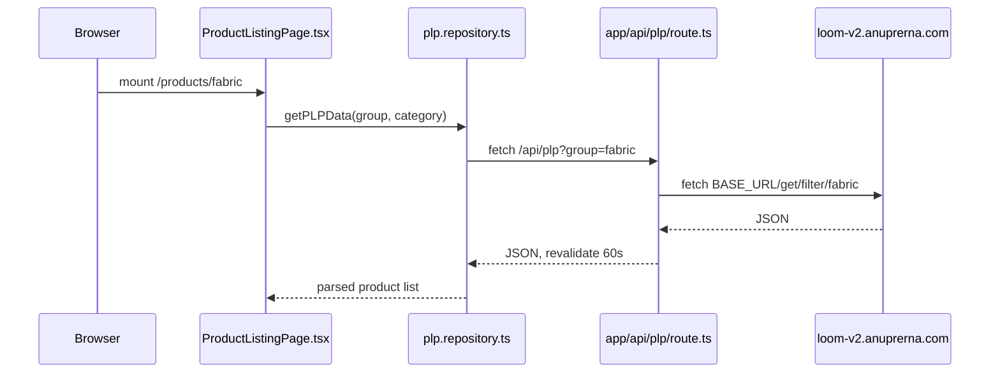
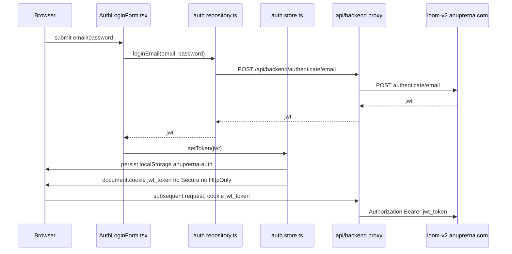
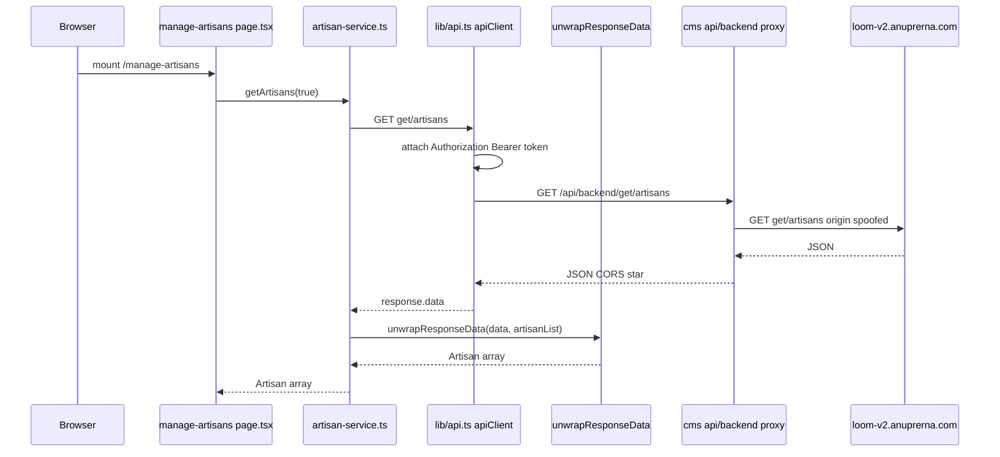
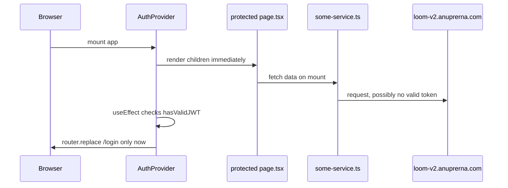
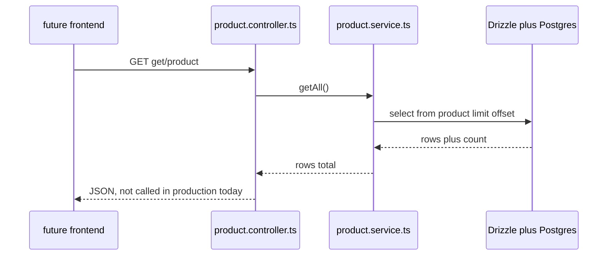

# Data Flow

How real requests move through this repo, traced hop by hop against the code on
`chore/agent-substrate`. For component ownership and system layout see
[`ARCHITECTURE.md`](./ARCHITECTURE.md); this document is only about the path a request takes at
runtime. For every place state is stored, see [`STATE-INVENTORY.md`](./STATE-INVENTORY.md).

**Ground truth as of this doc:** both `apps/storefront` and `apps/cms` serve real users, and both
send 100% of their traffic to the legacy Java/Spring backend at `loom-v2.anuprerna.com`.
`apps/api` (573 TypeScript files, 116 controllers) is merged into this branch and typechecks, but
carries **zero** production traffic — neither frontend's base URL points at it. Section 5 covers
what its path would look like if it were plugged in.

---

## 1. Storefront product listing page (PLP)

The PLP does **not** use the repository/adapter/client stack that the rest of the storefront
convention implies. It has its own bypass path.

| # | Hop | File:line | What happens |
|---|-----|-----------|--------------|
| 1 | Route entry | `apps/storefront/src/app/products/page.tsx:4` | `/products` immediately `redirect("/products/fabric")` |
| 2 | PLP page | `apps/storefront/src/app/products/[group]/page.tsx:36` | Renders `<ProductListingPage group={groupType} />`, no data call here |
| 3 | Client component | `apps/storefront/src/components/plp/ProductListingPage.tsx:73` | `useEffect` calls `plpRepository.getPLPData(group, categoryParam)`; also `:93 getFilterSegments`, `:237 getRelatedProducts` |
| 4 | "Repository" | `apps/storefront/src/lib/api/repositories/plp.repository.ts:24-26` | Builds `` `${origin}/api/plp?group=...` `` and calls plain `fetch()` directly — does **not** call `apiRequest`/`client.ts` |
| 5 | Next.js route handler | `apps/storefront/src/app/api/plp/route.ts:4` | `const BASE_URL = env.NEXT_PUBLIC_SPRINGBOOT_API_URL.replace(/\/$/, "")` — reads the legacy Spring Boot URL directly and fetches `${BASE_URL}/get/filter/fabric`, `/get/color-list`, etc. (`:18-25`) |
| 6 | Legacy backend | `loom-v2.anuprerna.com` (Spring Boot) | Returns product/filter JSON, cast straight through, no schema validation |



### The two undocumented data paths

There are two separate ways storefront code reaches the legacy backend, and nothing in the repo
states this split. An agent that only reads `client.ts` will miss path B entirely.

**Path A — the intended path**, used by `catalog.repository.ts` and `cart.repository.ts` only:

- `apps/storefront/src/lib/api/client.ts:7-19` `getBaseUrl()` — if running in the browser
  (`typeof window !== "undefined"`), always returns `"/api/backend"` regardless of mode; on the
  server, returns `NEXT_PUBLIC_NEST_API_URL` if `mode === "nest"`, else `NEXT_PUBLIC_SPRINGBOOT_API_URL`.
- `apps/storefront/src/lib/api/client.ts:27-69` `apiRequest()` — builds the URL, plain `fetch`,
  throws on non-2xx, `response.json() as Promise<T>` (a cast, no runtime validation).
- `apps/storefront/src/app/api/backend/[...path]/route.ts` — generic proxy all Path-A traffic
  passes through in the browser. Line 4-5 hardcodes a production bearer-style secret:
  ```
  const LOOM_TABLE_EXPLORER_TOKEN = "<REDACTED - see apps/storefront/.env.example>..."
  ```
  set on outgoing requests at `:23` (`X-Loom-Table-Explorer-Token`). `:18-20` spoof
  `origin`/`referer` to `http://localhost:4200` to satisfy the legacy backend's CORS filter.
  **This is a committed production credential — dangerous regardless of documentation status.**
- Legacy vs Nest adapter split lives in `apps/storefront/src/lib/api/adapters/` — four files:
  `legacy-catalog.adapter.ts`, `nest-catalog.adapter.ts`, `legacy-cart.adapter.ts`,
  `nest-cart.adapter.ts`. Each pair maps a backend-shaped DTO to a domain type, e.g.
  `mapLegacyProductToDomain` (`legacy-catalog.adapter.ts:34`) vs `mapNestProductToDomain`
  (`nest-catalog.adapter.ts:8`), selected in `apps/storefront/src/lib/api/repositories/catalog.repository.ts:23`
  by `const mode = env.NEXT_PUBLIC_API_MODE`.
- `NEXT_PUBLIC_API_MODE` is declared `apps/storefront/src/env.ts:5` as
  `z.enum(["legacy","nest"]).default("legacy")`, read again at `:13`. Grepped across the whole repo
  (env files, CI, docs) for anywhere it is set to `"nest"` — **no matches**. It is always `"legacy"`
  in practice, so every `nest-*.adapter.ts` file and `nest` branch is currently dead code.

**Path B — the bypass**, ten Next.js route handlers that skip the repository/client/adapter stack
entirely and read `NEXT_PUBLIC_SPRINGBOOT_API_URL` themselves:

| File | Line reading the URL |
|---|---|
| `apps/storefront/src/app/api/plp/route.ts` | `:4` |
| `apps/storefront/src/app/api/plp/segments/route.ts` | `:4` |
| `apps/storefront/src/app/api/plp/related/route.ts` | `:4` |
| `apps/storefront/src/app/api/blogs/route.ts` | `:4` |
| `apps/storefront/src/app/api/product/route.ts` | `:4` |
| `apps/storefront/src/app/api/search/route.ts` | `:4` |
| `apps/storefront/src/app/api/stories/route.ts` | `:4` |
| `apps/storefront/src/app/api/stories/[storyId]/route.ts` | `:4` |
| `apps/storefront/src/app/api/content/[blogId]/route.ts` | `:4` |
| `apps/storefront/src/app/api/navigation/story/[type]/route.ts` | `:4` |

`apps/storefront/src/app/api/backend/[...path]/route.ts:11` also reads
`NEXT_PUBLIC_SPRINGBOOT_API_URL`, but that one is the intended generic proxy (Path A), not a bypass.

**This split is the single most important thing an agent working on storefront data fetching needs
to know**: adding a Zod schema or auth header to `client.ts` will do nothing for the ten routes
above, because they never call it.

Note: `apps/storefront/src/lib/api.ts` is a separate, unrelated file with zero importers — dead
code, do not use it as a reference for either path.

---

## 2. Storefront login / auth

| # | Hop | File:line | What happens |
|---|-----|-----------|--------------|
| 1 | Form | `apps/storefront/src/components/auth/AuthLoginForm.tsx:39` | `const res = await authRepository.loginEmail(email, password)` |
| 2 | Repository | `apps/storefront/src/lib/api/repositories/auth.repository.ts:37` | `loginEmail` calls `apiRequest("authenticate/email", ...)` — Path A, goes through `client.ts` |
| 3 | Store | `apps/storefront/src/stores/auth.store.ts` | `setToken(res.jwt)` called at `AuthLoginForm.tsx:41` |
| 4 | Profile fetch | `apps/storefront/src/components/auth/AuthLoginForm.tsx:45` | `await profileRepository.getCustomerProfile(res.jwt)`, JWT passed explicitly |

`auth.repository.ts` endpoints used: `authenticate/email` (`:37`), `authenticate/social` (`:47`),
`customer/registration/social` (`:61`), `customer/registration` (`:82`), `check-email/tenant`
(`:23`), `send/password-reset/email` (`:92`). All via `apiRequest`, which in the browser always
resolves to `/api/backend` (`client.ts:12-14`).

### Where the JWT lands, and how it reaches the backend

`apps/storefront/src/stores/auth.store.ts`:

- `:51-53` `persist(..., { name: "anuprerna-auth" })` — zustand persist to `localStorage` (default
  storage engine, no override), no `partialize`, so `jwt`, `user`, and `isLoggedIn` are all
  persisted in plaintext.
- `:24-28` `setCookie` — on `setToken` (`:42`) also writes `document.cookie` directly:
  `jwt_token=<value>; expires=...; path=/; SameSite=Lax`. **No `Secure`, and `HttpOnly` is
  impossible from client JS by construction** — this cookie is fully readable by any script on the
  page. Deleted on logout (`:47` `deleteCookie("jwt_token")`).

The JWT then reaches the backend two ways:

1. **Proxy reads the cookie.** `apps/storefront/src/app/api/backend/[...path]/route.ts:34-37`:
   ```
   const authCookie = request.cookies.get("jwt_token")?.value;
   if (authCookie && !requestHeaders.has("authorization")) {
     requestHeaders.set("Authorization", `Bearer ${authCookie}`);
   }
   ```
   This is the only server-side construction of the `Authorization` header for Path-A traffic.
2. **Client sets it explicitly.** `profile.repository.ts` (e.g. lines 66-67, 77-78, 92-93) attaches
   `Authorization: Bearer ${jwtToken}` itself when a token is passed in directly, as
   `AuthLoginForm.tsx:45` does. Because the proxy only sets the header `if (!requestHeaders.has(...))`,
   an explicit client-set header wins over the cookie-derived one.

Path-B bypass routes (`api/plp/*`, `api/product`, etc.) never see the JWT at all — they call the
legacy host directly with no auth, which is correct only if those endpoints are public.



**Dangerous, plainly:** a live production bearer token is hardcoded in
`apps/storefront/src/app/api/backend/[...path]/route.ts:4-5`, committed to source control.

---

## 3. CMS data fetch

Every CMS list/detail page funnels through one choke point: `unwrapResponseData()`.

| # | Hop | File:line | What happens |
|---|-----|-----------|--------------|
| 1 | Page | `apps/cms/src/app/manage-artisans/page.tsx:45` | `const data = await ArtisanService.getArtisans(true)` |
| 2 | Service | `apps/cms/src/services/artisan-service.ts:129` | `apiClient.get(\`/get/artisans?includeInactive=${includeInactive}\`)` |
| 3 | Unwrap | `apps/cms/src/services/artisan-service.ts:130` | `unwrapResponseData<any[]>(response.data, 'artisanList')` |
| 4 | HTTP client | `apps/cms/src/lib/api.ts:5-10` | `axios.create({ baseURL: ConfigurationService.SERVER_ENDPOINT, ... })` |
| 5 | Request interceptor | `apps/cms/src/lib/api.ts:12-19` | Attaches `Authorization: Bearer <token>` from `AuthService.retrieveJWT()` on every outgoing request, browser only |
| 6 | Proxy route | `apps/cms/src/app/api/backend/[...path]/route.ts` | Forwards to legacy backend |
| 7 | Legacy backend | `loom-v2.anuprerna.com` | Returns JSON in one of several shapes |

`ConfigurationService.SERVER_ENDPOINT` (`apps/cms/src/lib/config.ts:19`) is
`typeof window !== "undefined" ? "/api/backend" : RAW_SERVER_ENDPOINT` — same in-browser-always-proxy
pattern as the storefront.

### `unwrapResponseData()` — the single choke point

`apps/cms/src/lib/api-helper.ts:1-36`, full function:

```
export function unwrapResponseData<T = any>(data: any, preferredKey?: string): T {
  if (!data) return [] as unknown as T;
  if (Array.isArray(data)) return data as unknown as T;
  if (data.success === false) throw new Error(data.message || 'Backend request rejected.');
  if (preferredKey && data[preferredKey] !== undefined) return data[preferredKey] as T;
  const keys = Object.keys(data).filter(k => !['success','message','status','statusCode','timestamp'].includes(k));
  for (const k of keys) { if (Array.isArray(data[k])) return data[k] as unknown as T; }
  if (keys.length === 1 && typeof data[keys[0]] === 'object') return data[keys[0]] as T;
  return data as T;
}
```

Heuristic, in order: empty/falsy data returns `[]`; an already-array response passes through
unchanged; `success: false` throws; a caller-supplied `preferredKey` (e.g. `'artisanList'`) is
preferred if present; otherwise it auto-detects the first object property that is itself an array;
failing that, if there is exactly one non-metadata key and it's an object, unwrap it; otherwise
return the raw object. Every CMS service (30 files) calls this with `T = any` implicitly at every
call site — there is no schema validation anywhere in this path, so a shape change in the legacy
backend response silently changes what callers receive rather than failing loudly.

### CMS proxy — `apps/cms/src/app/api/backend/[...path]/route.ts`

- `:3` `const TARGET_HOST = 'https://loom-v2.anuprerna.com'` — hardcoded, no env override.
- `:14-15` spoofs `origin`/`referer` to `https://weave.bloomscorp.com` to satisfy the legacy CORS filter.
- `:46` `responseHeaders.set('Access-Control-Allow-Origin', '*')` on a route that forwards
  `Authorization` bearer tokens (`:48` also allows `Authorization` in `Access-Control-Allow-Headers`).



---

## 4. CMS login and auth gating

`apps/cms/src/lib/auth-service.ts:105-146` `AuthService.login()` posts to
`${ConfigurationService.SERVER_ENDPOINT}/authenticate/email`, extracts `jwt || token`, and calls
`storeJWT()` (`:123`) then, separately, `resolveAuthorityToken()` (`:130`) which hits
`get/authority/token` and stores the result under `localStorage['authority']` (`:171`).

Full localStorage write set for a login, all in `auth-service.ts`:

- `:28` `token`, `:29` `jwt` — plain
- `:41-45` five obfuscated chunk keys — the JWT is split into 5 substrings and stored under
  randomized-looking key names `KEY_033`, `KEY_06`, `KEY_40`, `KEY_63`, `KEY_25` (values defined
  `:18-22`), reconstructed by concatenation in `retrieveJWT()` (`:48-62`). Comment at `:31`:
  "Shatter into 5 chunks matching Angular JWTService" — this mirrors the legacy Angular
  `weave-master` `JWTService` pattern verbatim. **This is obfuscation, not security**: the full
  token is trivially reassembled by reading five known `localStorage` keys, and `retrieveJWT()`
  itself prefers the plain `jwt`/`token` keys first (`:51`) before ever touching the chunks.
- `:125` `user_email`

`isTokenExpired()` (`:64-84`) decodes the JWT payload and checks `exp` — grepped for callers across
`apps/cms/src`: **zero**, dead code. `hasValidJWT()` (`:86-89`) does not check expiry at all, only
`!!(token && token.trim().length > 0)`.

### The guard is a post-mount effect, not middleware

`apps/cms/src/context/AuthContext.tsx`:

- `:34-69` first `useEffect` — runs after mount, calls `AuthService.hasValidJWT()` (`:38`),
  populates `isAuthenticated`/`isLoading` state.
- `:72-80` second `useEffect` — depends on `[pathname, isAuthenticated, isLoading, router]`; only
  after `isLoading` is false does it `router.replace('/login')` (`:76`) for unauthenticated users.

`find apps/cms -iname "middleware.ts"` returns nothing — confirmed no `middleware.ts` exists
anywhere in `apps/cms`. Because both effects run client-side after React has already mounted and
rendered the protected page's component tree, **any `useEffect`/render-time code in the protected
page itself — including its own data fetches — executes before the redirect can fire.** For a page
whose top-level render calls a service (a common CMS pattern, see `manage-artisans/page.tsx:45` in
Section 3), that fetch goes out over the network using whatever token is in `localStorage`
(possibly none) before the user is ever redirected to `/login`.



**Dangerous, plainly:** the only auth boundary in the CMS is a client-side effect that runs after
the protected page's own code has already executed, so a direct URL visit briefly renders and
fetches with the protected page before any redirect occurs.

---

## 5. The not-yet-live path: `apps/api`

`apps/api` (573 TypeScript files, 116 controllers, merged into `chore/agent-substrate`) is a NestJS
service with a real Drizzle/Postgres layer. It is not called by either frontend: `client.ts`'s
`NEXT_PUBLIC_NEST_API_URL` default is `https://api.v2.anuprerna.com` (`apps/storefront/src/env.ts:7,15`),
`NEXT_PUBLIC_API_MODE` is always `"legacy"` (Section 1), and grepping both frontends for any
reference to `apps/api`'s local port or path finds nothing pointing at it. Zero production requests
transit this code today.

Representative real flow — product list, `apps/api/src/commerce/product`:

| Layer | File:line | What happens |
|---|---|---|
| Controller | `apps/api/src/commerce/product/product.controller.ts:10-13` | `@Get("get/product") async getAll() { return this.service.getAll(); }` |
| Service | `apps/api/src/commerce/product/product.service.ts:17-27` | `findAll(limit, offset)` — builds two parallel Drizzle queries |
| Drizzle query | `apps/api/src/commerce/product/product.service.ts:19-21` | `this.db.select().from(product).orderBy(desc(product.id)).limit(limit).offset(offset)` plus a `count(*)` query |
| Schema | `apps/api/src/database/schema/index.js` (re-exported `product` table) | Backs the query above; 116 `pgTable`s total in `apps/api/src/database/schema/` |
| Connection | `apps/api/src/database/database.module.ts` `DATABASE_CONNECTION` | Injected via `@Inject(DATABASE_CONNECTION)` |

Note this particular controller's service talks to Drizzle directly with no intermediate
repository class; other product subdomains (`fabric-product`, `custom-product`, `category`,
`sub-category`, etc.) do have a `repository/` layer between service and Drizzle — the pattern is
not uniform across `apps/api`.



Integration tests for this layer run via `pnpm test:int`, backed by
`apps/api/src/database/database.int.spec.ts` — see [`TESTING.md`](./TESTING.md) for how that's
wired. For endpoint surface and route conventions across all 116 controllers, see
[`ENDPOINT-INVENTORY.md`](./ENDPOINT-INVENTORY.md) and [`MODULE-MAP.md`](./MODULE-MAP.md). For the
gap between this branch and a real cutover, see [`KNOWN-GAPS.md`](./KNOWN-GAPS.md).
