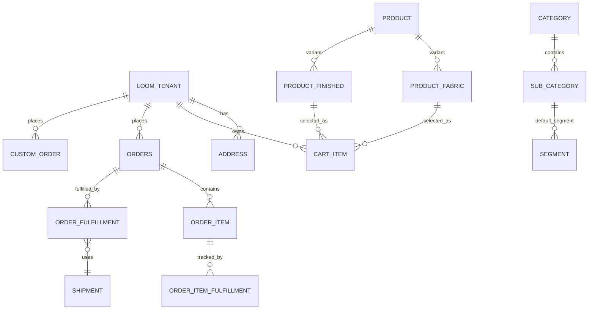
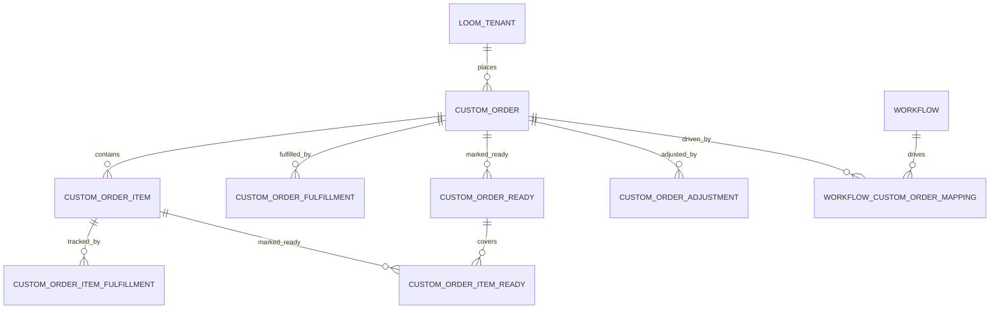
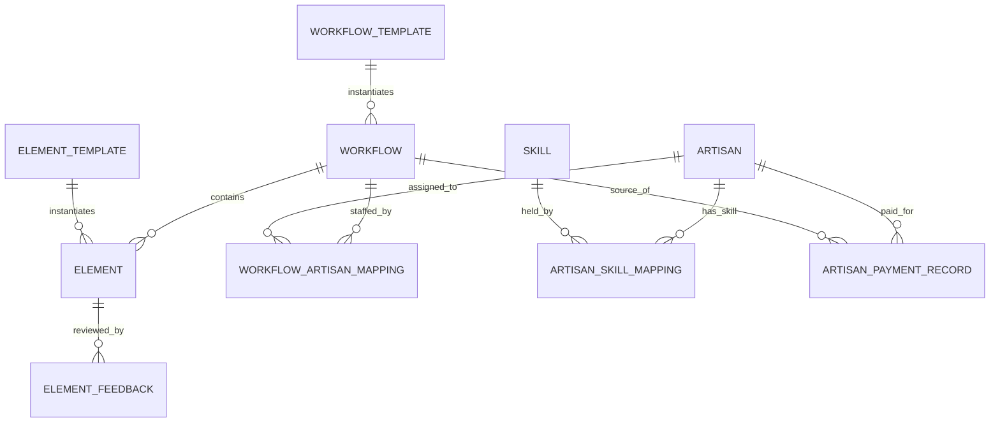

# Data Inventory

Source of truth for what business data exists on the platform, and where. Written for a client
demo and as an orientation doc for AI coding agents working in `apps/api`.

Verified against the live-introspected Drizzle schema on branch `chore/agent-substrate`:

- `apps/api/src/database/schema/schema.ts` — 116 `pgTable` definitions, 2,952 lines
- `apps/api/src/database/schema/relations.ts` — 94 relation blocks, 975 lines
- `apps/api/src/database/schema/0000_dashing_xavin.sql` — 1,992 lines, 124 indexes, 134 foreign keys

For system architecture and request flow, see `docs/ARCHITECTURE.md` and `docs/DATA-FLOW.md`. For
runtime/process state (queues, caches, sessions), see `docs/STATE-INVENTORY.md`. For the module
that owns each table, see `docs/MODULE-MAP.md`.

All counts below were produced by grepping the schema files directly (`grep -c "pgTable("`,
manual domain sort of all 116 table names) — not estimated.

## 1. Domain grouping — all 116 tables

17 domains, verified to sum to 116.

| # | Domain | Tables |
|---|--------|--------|
| 1 | Identity / tenant | 8 |
| 2 | Catalog / product | 24 |
| 3 | Cart | 1 |
| 4 | Orders & fulfilment | 7 |
| 5 | Custom orders | 7 |
| 6 | Payments | 3 |
| 7 | Inventory & warehouse | 4 |
| 8 | Shipping / logistics | 1 |
| 9 | Content — blog / story / FAQ | 10 |
| 10 | Artisans & workflow (ArtisanFlow) | 9 |
| 11 | Loyalty | 2 |
| 12 | Reviews & feedback | 3 |
| 13 | SEO | 1 |
| 14 | Notifications — email / WhatsApp | 2 |
| 15 | Image optimization | 5 |
| 16 | Diagnostics / cron | 1 |
| 17 | AI / vector | 2 |
| — | Discounts, pricing, misc lookups (segment, tag, forex, impact) | 26 |
| — | **Total** | **116** |

The last row groups tables that are genuinely cross-cutting lookups (discount profiles, volume
discount, forex rates, segment/tag taxonomy, impact factor, special-status, settings) rather than
force-fitting them into one of the 16 named domains. Below, each domain gets one row per table it
actually owns; the grouping above is the navigation aid, not a strict partition.

### 1. Identity / tenant

| Table | Purpose | Key columns | Main FKs |
|---|---|---|---|
| `loom_tenant` | Root user/account record (customers, staff, artisans all live here) | `email` (encrypted at rest), `user_password` (scrypt hash), `user_type`, `gender`, `active`/`suspended`/`banned` | none (root) |
| `super_user` | Elevated/admin flag on a tenant | `tenant_id` | → `loom_tenant.id` |
| `user_role` | Role assignment | `user_id`, role enum | → `loom_tenant.id` |
| `authentication_log` | Login/auth event audit trail | `tenant_id`, action, timestamp | (see relations.ts) |
| `verification_token` | Email/phone verification & reset tokens | `tenant_id`, token, expiry | → `loom_tenant.id` |
| `address` | Saved shipping/billing addresses | `tenant_id`, address fields | → `loom_tenant.id` |
| `customer` | Customer-facing profile extension of a tenant | `tenant_id` | → `loom_tenant.id` |
| `special_status` | Named status tag (e.g. VIP) attachable to a tenant/product | `id`, name | — |

### 2. Catalog / product

| Table | Purpose | Key columns | Main FKs |
|---|---|---|---|
| `product` | Core product record — the parent of fabric/finished variants | `badge_profile_id`, `fabric_profile_id`, `finish_profile_id`, `made_to_order_profile_id`, `made_to_order_fabric_id` (self-FK) | → 5 profile tables, → `product` (self) |
| `product_fabric` | Fabric-type product variant | `product_id` | → `product.id` |
| `product_finished` | Finished/ready-made product variant | `product_id` | → `product.id` |
| `catalog` | Catalog grouping/listing entity | — | — |
| `catalog_item` | Item within a catalog (shared with ArtisanFlow) | — | — |
| `catalog_item_media` | Media asset attached to a catalog item | — | → `catalog_item` |
| `catalog_pdf` | PDF asset (spec sheet, lookbook) linked to catalog | — | — |
| `category` | Top-level product category | — | — |
| `sub_category` | Category child; also carries the default profile wiring for products in it | `badge_profile_id`, `custom_size_profile_id`, `fabric_profile_id`, `finish_profile_id`, `made_to_order_profile_id`, `segment_id`, `volume_discount_profile_id` | → 6 profile/segment tables |
| `segment` | Marketing/merchandising segment | `category_id` | → `category.id` |
| `tag` | Free-form product tag | — | — |
| `sku_group` | Grouping of SKUs (e.g. a color/size family) | — | — |
| `color` | Color master | — | — |
| `material` | Material master | — | — |
| `pattern` | Pattern master | — | — |
| `badge_profile` | Named badge configuration (e.g. "Bestseller") | — | — |
| `badge_profile_item` | Individual badge within a profile | `profile_id` | → `badge_profile.id` |
| `size_profile` | Sizing scheme | — | — |
| `size_profile_option` | Individual size option within a scheme | `profile_id` | → `size_profile.id` |
| `size_profile_guide` | Size guide entry (measurement per option) | `option_id`, `profile_id` | → `size_profile_option.id`, → `size_profile.id` |
| `custom_size_profile` | Custom/made-to-measure sizing scheme | — | — |
| `custom_size_profile_item` | Entry within a custom size profile | `profile_id` | → `custom_size_profile.id` |
| `fabric_profile` | Fabric options configuration for a product line | — | — |
| `fabric_profile_item` | Individual fabric option | — | → `fabric_profile.id` |
| `finish_profile` | Finish options configuration | — | — |
| `finish_profile_item` | Individual finish option | `profile_id` | → `finish_profile.id` |
| `made_to_order_profile` | Made-to-order production configuration | — | — |
| `product_size_profile` | Join: product ↔ size profile | — | → `product`, → `size_profile` |
| `product_zoho_relation` | External-system link: product ↔ Zoho item | — | → `product.id` |
| `product_image_gallery_seo` | SEO metadata for a product's image gallery | — | → `product.id` |
| `temp_product_meta` | Scratch/staging metadata during product import | — | — |

### 3. Cart

| Table | Purpose | Key columns | Main FKs |
|---|---|---|---|
| `cart_item` | Line item in a tenant's active cart | `tenant_id`, `fabric_product_id`, `finished_product_id`, `selected_fabric_id`, `selected_size_option_id` | → `loom_tenant.id`, → `product_fabric.id`, → `product_finished.id`, → `size_profile_option.id` |

### 4. Orders & fulfilment

| Table | Purpose | Key columns | Main FKs |
|---|---|---|---|
| `orders` | The stock/standard order (see order model below) | `tenant_id`, `total`, `shipping_mode`, `coupon_*` | → `loom_tenant.id` |
| `order_item` | Line item on an order, carries `order_type` | `order_id`, `order_type` (`IN_STOCK`\|`MADE_TO_ORDER`\|`PRE_ORDER`) | → `orders.id` |
| `order_fulfillment` | Fulfilment record for an order | `order_id`, `shipment_id` | → `orders.id`, → `shipment.id` |
| `order_item_fulfillment` | Fulfilment status at line-item grain | — | → `order_item` |
| `order_ready` | "Ready to ship" marker for an order | — | → `orders` |
| `order_item_ready` | "Ready to ship" marker at line-item grain | — | → `order_item` |
| `order_review_scheduled_email` | Scheduled post-purchase review-request email | `order_id` | → `orders.id` |

### 5. Custom orders

| Table | Purpose | Key columns | Main FKs |
|---|---|---|---|
| `custom_order` | The made-to-order/bespoke order header — parallel structure to `orders`, not a subtype of it | `tenant_id`, `order_type` (free-text, default `'FABRIC'`), `adjusted_total`, `cc_emails` | → `loom_tenant.id` |
| `custom_order_item` | Line item on a custom order | `custom_order_id` | → `custom_order.id` |
| `custom_order_fulfillment` | Fulfilment record for a custom order | — | → `custom_order` |
| `custom_order_item_fulfillment` | Fulfilment at custom line-item grain | — | → `custom_order_item` |
| `custom_order_ready` | "Ready" marker for a custom order | — | → `custom_order` |
| `custom_order_item_ready` | "Ready" marker at custom line-item grain | `custom_order_item_id`, `custom_order_ready_id` | → `custom_order_item.id`, → `custom_order_ready.id` |
| `custom_order_adjustment` | Manual price/scope adjustment on a custom order | `custom_order_id` | → `custom_order.id` |

### 6. Payments

| Table | Purpose | Key columns | Main FKs |
|---|---|---|---|
| `razorpay_transaction` | Razorpay payment gateway transaction record | `loom_order_id` | → `orders.id` |
| `stripe_transaction` | Stripe payment gateway transaction record | — | → `orders` (by convention, see `payment` module) |
| `purchase_order_feedback` | Post-purchase feedback tied to an order | `order_id` | → `orders.id` |

### 7. Inventory & warehouse

| Table | Purpose | Key columns | Main FKs |
|---|---|---|---|
| `warehouse` | Warehouse/location master | — | — |
| `inventory_adjustment` | Stock adjustment event | `reason_id`, `user_id`, `warehouse_id` | → `inventory_adjustment_reason.id`, → `loom_tenant.id`, → `warehouse.id` |
| `inventory_adjustment_item` | Line item within an adjustment | — | → `inventory_adjustment` |
| `inventory_adjustment_reason` | Reason-code master (e.g. damage, recount) | `reason` (unique) | — |
| `inventory_restock_request` | Restock request record | — | — |

### 8. Shipping / logistics

| Table | Purpose | Key columns | Main FKs |
|---|---|---|---|
| `shipment` | Shipment record, linked from order fulfilment | — | ← `order_fulfillment.shipment_id` |

### 9. Content — blog / story / FAQ

| Table | Purpose | Key columns | Main FKs |
|---|---|---|---|
| `blog_content` | Blog post | `author_id`, `blog_content_category_id` | → `loom_tenant.id`, → `blog_content_category.id` |
| `blog_content_category` | Blog category | `blog_content_type_id` | → `blog_content_type.id` |
| `blog_content_type` | Top-level blog type taxonomy | — | — |
| `blog_content_section` | Section/block within a blog post | `blog_content_id` | → `blog_content.id` |
| `story_content` | Artisan/brand story post | `author_id`, `story_content_category_id` | → `loom_tenant.id`, → `story_content_category.id` |
| `story_content_category` | Story category | — | — |
| `story_content_section` | Section/block within a story post | `story_content_id` | → `story_content.id` |
| `story_product_mapping` | Join: story ↔ featured product | `story_content_id` | → `story_content.id` |
| `faq` | FAQ entry, optionally attached to a blog or story | `blog_content_id`, `story_content_id` | → `blog_content.id`, → `story_content.id` |
| `faq_question` | Individual Q&A within an FAQ entry | `faq_id` | → `faq.id` |

### 10. Artisans & workflow — ArtisanFlow

| Table | Purpose | Key columns | Main FKs |
|---|---|---|---|
| `artisan` | Artisan master record | — | — |
| `artisan_skill_mapping` | Join: artisan ↔ skill | — | → `artisan`, → `skill` |
| `artisan_payment_record` | Payment made to an artisan for workflow work | `artisan_id`, `workflow_id` | → `artisan.id`, → `workflow.id` |
| `skill` | Skill master (e.g. embroidery, weaving) | — | — |
| `workflow` | A production workflow instance driving an order/custom order through steps | — | — |
| `workflow_template` | Reusable workflow definition | — | — |
| `workflow_artisan_mapping` | Join: workflow ↔ assigned artisan | — | → `workflow`, → `artisan` |
| `workflow_custom_order_mapping` | Join: workflow ↔ custom order it fulfils | — | → `workflow`, → `custom_order` |
| `element` | A step instance within a workflow | `workflow_id` | → `workflow.id` |
| `element_template` | Reusable step definition | — | — |
| `element_feedback` | Feedback/QC note on a step | — | → `element` |
| `step_element` | ArtisanFlow step element (see caveat below) | — | — |
| `step_element_template` | Reusable template for a step element | — | — |
| `step_element_artisan_mapping` | Join: step element ↔ artisan | — | — |
| `subprocess_element` | ArtisanFlow subprocess element | — | — |
| `subprocess_element_template` | Reusable template for a subprocess element | — | — |
| `subprocess_element_artisan_mapping` | Join: subprocess element ↔ artisan | — | — |

Counted as 9 in the summary table for the domains explicitly named in the brief
(`artisan`, `artisan_payment_record`, `artisan_skill_mapping`, `skill`, `workflow`, `element`,
`step_element`, `subprocess_element`, `catalog_item`); the remaining templates/mappings are folded
into the same functional area in practice — see full row list above for all of them.

### 11. Loyalty

| Table | Purpose | Key columns | Main FKs |
|---|---|---|---|
| `loyalty_program_config` | Loyalty program rules/tiers | — | — |
| `loyalty_program_config_audit_log` | Change history for loyalty config | — | → `loyalty_program_config` |

### 12. Reviews & feedback

| Table | Purpose | Key columns | Main FKs |
|---|---|---|---|
| `review` | Product/order review | — | — |
| `element_feedback` | QC feedback on a workflow step (also listed under ArtisanFlow) | — | → `element` |
| `purchase_order_feedback` | Post-purchase feedback (also listed under Payments/Orders) | `order_id` | → `orders.id` |

### 13. SEO

| Table | Purpose | Key columns | Main FKs |
|---|---|---|---|
| `product_image_gallery_seo` | SEO metadata for product image gallery (also listed under Catalog) | — | → `product.id` |

### 14. Notifications — email / WhatsApp

| Table | Purpose | Key columns | Main FKs |
|---|---|---|---|
| `email_notification_history` | Sent-email audit log | entity type/trigger/status enums | — |
| `whatsapp_notification_history` | Sent-WhatsApp-message audit log | entity type/trigger/status/opt-in enums | — |

### 15. Image optimization

| Table | Purpose | Key columns | Main FKs |
|---|---|---|---|
| `image_optimization_record` | One optimization job for one image | state/priority enums | — |
| `image_optimization_control` | Global on/off + throttling control | — | — |
| `image_optimization_tool` | Registered optimization tool/engine | — | — |
| `image_optimization_tool_setting` | Per-tool configuration | — | → `image_optimization_tool` |
| `image_optimization_worker_session` | Worker run/session record | stop-reason enum | — |

### 16. Diagnostics / cron

| Table | Purpose | Key columns | Main FKs |
|---|---|---|---|
| `cron_job_log` | Scheduled job run log | — | — |
| `log` | Generic application log record | `log_type`, `logger`, `message` | — |

Counted as 1 domain-representative table (`cron_job_log`) in the summary; `log` is the
general-purpose sibling.

### 17. AI / vector

| Table | Purpose | Key columns | Main FKs |
|---|---|---|---|
| `product_vector` | pgvector embedding (1536-dim) for a product, for similarity search | `product_id` (unique), `embedding` | → `product.id` |
| `blog_vector` | pgvector embedding for a blog post | `blog_content_id` (unique), `embedding` | → `blog_content.id` |

### Remaining cross-cutting lookups (26 tables)

Discounts (`discount`, `volume_discount_profile`, `volume_discount_profile_item`), forex
(`forex`, `forex_exchange_rate`), impact (`impact_factor`), navigation/config (`settings`,
`filter_page_config`), tenant-facing badges/status already listed under Catalog/Identity, plus
the join and lookup tables that sit between the domains above (`product_size_profile`,
`story_product_mapping`, `sub_category_audit`, etc.). These are real tables backing real
`commerce/*` subdomains — see `docs/MODULE-MAP.md` for the module that owns each — but they don't
carry enough independent identity to deserve their own top-level domain section.

## 2. ER diagrams

### Commerce core — tenant, product, cart, order



### Custom order family



### Workflow / ArtisanFlow



## 3. The order model — 4 business order types, 2 table families

The business describes "4 order types." The schema implements this as **one enum plus a parallel
table family**, not four tables.

- `order_type` enum (`apps/api/src/database/schema/schema.ts:41-42`, defined twice as `orderType`
  and `orderTypeEnum` — both resolve to the same three values): `IN_STOCK`, `MADE_TO_ORDER`,
  `PRE_ORDER`.
- This enum lives on `order_item.order_type` — it classifies each **line item** of a standard
  order (`orders` / `order_item`), not the order header itself. An order can, in principle, mix
  line items of different types.
- The 4th business-facing type — **custom / bespoke** — is not a value of this enum at all. It is
  a **separate table family**: `custom_order`, `custom_order_item`, `custom_order_fulfillment`,
  `custom_order_ready`, `custom_order_adjustment`, `custom_order_item_fulfillment`,
  `custom_order_item_ready`. `custom_order` has its own free-text `order_type` varchar column
  (default `'FABRIC'`) that is unrelated to the `order_type` enum on `order_item`.

So "4 order types" maps to the schema as:

| Business type | Schema representation |
|---|---|
| In-stock | `order_item.order_type = 'IN_STOCK'` on a row in `orders`/`order_item` |
| Made-to-order | `order_item.order_type = 'MADE_TO_ORDER'` on a row in `orders`/`order_item` |
| Pre-order | `order_item.order_type = 'PRE_ORDER'` on a row in `orders`/`order_item` |
| Custom / bespoke | An entirely separate row family: `custom_order` + `custom_order_item` (+ their own fulfilment/ready/adjustment tables) |

**Implication for anyone building order-related features:** a query for "all orders of type X" is
not a single `WHERE order_type = X` — it is a `UNION`-shaped concern across `orders`/`order_item`
(for the first three) and `custom_order`/`custom_order_item` (for the fourth), and the fulfilment,
"ready," and item-level fulfilment tables are duplicated per family (`order_fulfillment` vs.
`custom_order_fulfillment`, `order_ready` vs. `custom_order_ready`, etc.) rather than shared. There
is no FK between `orders` and `custom_order` — they are two independent order headers that happen
to share `tenant_id` as their only common ancestor.

## 4. Data sensitivity

- **`loom_tenant.email`** — stored **encrypted at rest**. Decryption happens only at the API
  boundary via a header-driven flow: the storefront proxy (`apps/storefront/src/app/api/backend/
  [...path]/route.ts`) reads an `x-loom-tenant-decrypt-fingerprint` header and forwards it so the
  backend knows to decrypt for that caller; `commerce/cart/service/cart.service.ts` shows the
  decrypt-at-read-time pattern (`emailEncoder.decode(tenant.email)`), with the failure mode
  deliberately swallowed per-record so one bad row doesn't fail a whole listing. Plaintext email is
  never persisted — see `docs/adr/0003-managed-postgres-and-email-crypto.md`.
- **`loom_tenant.user_password`** — scrypt-derived hash (`apps/api/src/auth/service/
  gatekeeper.service.ts`, Node's built-in `crypto.scrypt`). Legacy Loom passwords were **not
  exportable** from the source system's API — there is no plaintext or reversible password data to
  migrate; new/reset passwords are the only path forward post-cutover.
- **PII-bearing tables**: `loom_tenant` (email, phone, DOB, gender), `address` (postal address),
  `customer`, `authentication_log` (login events tied to a tenant), `order_review_scheduled_email`
  and the notification-history tables (`email_notification_history`,
  `whatsapp_notification_history`) which carry contact-trigger metadata even though message bodies
  are not stored in these rows.
- No alarmism intended by this list — it is the standard PII surface for a commerce platform with
  accounts, addresses, and order communication. Treat it as the checklist for access-control review,
  not as a finding of a problem.

## 5. ArtisanFlow table-prefix caveat — verified, and false as documented

`apps/api/CLAUDE.md` and `apps/api/src/workflow/workflow.module.ts` both state ArtisanFlow uses
`af_`-prefixed tables ("ArtisanFlow — `/af/*` routes, `af_` tables"). This was checked directly
against the schema:

```
grep -c '^export const.*= pgTable("af_' apps/api/src/database/schema/schema.ts   →  0
```

**No table in the 116-table schema uses an `af_` prefix.** ArtisanFlow's actual data lives in
plainly-named, unprefixed tables: `workflow`, `workflow_template`, `workflow_artisan_mapping`,
`workflow_custom_order_mapping`, `artisan`, `artisan_skill_mapping`, `artisan_payment_record`,
`skill`, `element`, `element_template`, `element_feedback`, `step_element`,
`step_element_template`, `step_element_artisan_mapping`, `subprocess_element`,
`subprocess_element_template`, `subprocess_element_artisan_mapping`, `catalog_item`,
`catalog_item_media`. The real implementation of these tables also lives under `commerce/artisan`,
`commerce/workflow`, `commerce/skill`, and `commerce/product` (for `catalog_item`) — not under the
top-level `src/workflow/` module, which is an empty shell (see `docs/MODULE-MAP.md` section 1).
Treat the `af_`/`workflow/` module documentation as stale; this document is the corrected
reference.

## 6. Migration / drift caveat

There is exactly **one** Drizzle migration snapshot: `0000_dashing_xavin.sql`, referenced by a
single entry in `apps/api/src/database/schema/meta/_journal.json` (`idx: 0`, tag
`0000_dashing_xavin`). This means:

- There is **no ongoing migration workflow** — no sequence of incremental migrations, no rollback
  chain, nothing to `drizzle-kit migrate` forward from a prior state.
- There is **no automated drift check** between this snapshot and the live production database.
  The schema files were produced by introspecting the live DB once (per `apps/api/CLAUDE.md`:
  "Schema in `database/schema/` is introspected from the running Postgres via `pnpm db:introspect`
  — don't hand-edit, re-run introspect after schema changes"), and nothing in the repo verifies
  they still match today.
- Practically: treat this document and the schema files as a snapshot as of the last introspect
  run, not a live contract. Before relying on a table/column for a demo or a build, a fresh
  `pnpm db:introspect` (or a direct `\d` against the live DB) is the only way to confirm current
  shape.
